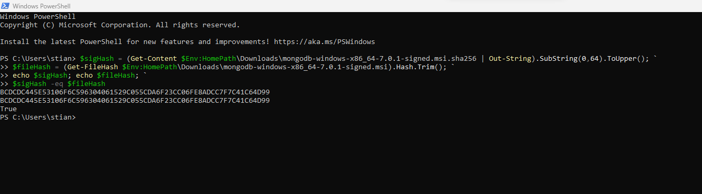
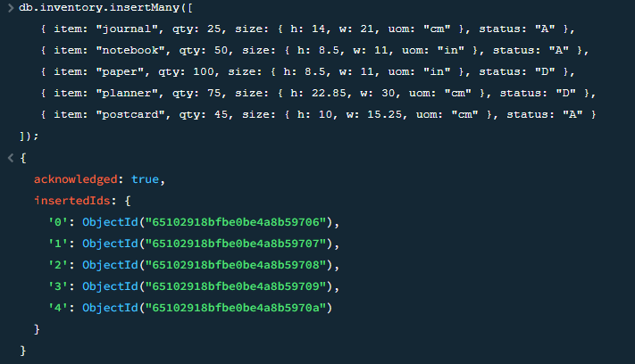
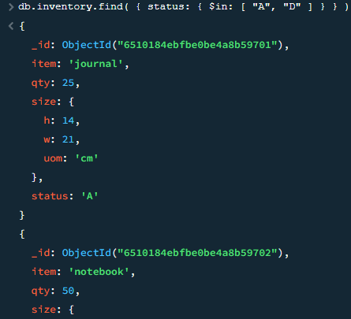
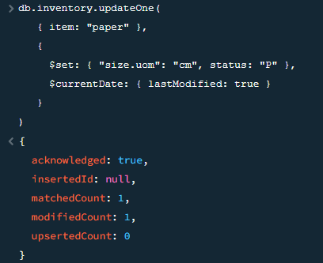
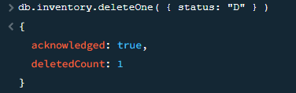

# Report Assignment 3

## Technical problems
I did not encounter any technical problems during the instalation and use of MongoDB.

## Screenshot of verifying installation package:

## Results from each CRUD operation:

### Create

### Read

### Update

### Delete

## Map-Reduce function (aggregation)

The implemented Map-Reduce operation in Experiment 2 is valuable because it enables complex data aggregation and transformation on large datasets. It is particularly useful for calculating averages and totals for specific items in this case. The resulting collection, "map_reduce_example2," provides a concise summary of ordering patterns for different items, including the count of orders, total quantity ordered, and average quantity per order. This information is crucial for making informed decisions related to inventory management, pricing strategies, and understanding customer preferences, ultimately facilitating data-driven insights and actions.